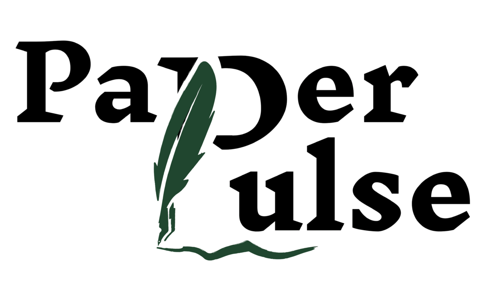

<p align="center">
  
</p>

# PaperPulse

**Team C2-App-069** · Trợ lý nghiên cứu học thuật bằng AI — tổng quan tài liệu, kiểm tra PDF, và trực quan hoá tri thức.

> Tự động tổng hợp Literature Review từ Semantic Scholar/OpenAlex/arXiv, kiểm tra văn phong + citation của paper người dùng tự viết, và trực quan hoá toàn bộ review thành sơ đồ tri thức tương tác — tất cả với trích dẫn đã được xác minh, không bịa nguồn.

---

## 🧩 Vấn đề (Problem)

Viết tổng quan tài liệu cho luận văn hay paper là một trong những việc tốn thời gian nhất của sinh viên/nhà nghiên cứu:

- **Tốn hàng tuần** để tìm bài, đọc hàng trăm abstract/full-text, nhóm theo phương pháp/kết quả, rồi viết lại có trích dẫn đúng.
- **1 góc nhìn, bỏ sót góc khác** — search 1 câu query trên 1 database duy nhất thường chỉ trùng **~20%** với những gì chuyên gia thật sự chọn ([LSE Study, 2026](https://arxiv.org/abs/2603.20235)).
- **LLM hỗ trợ viết dễ bịa trích dẫn** (citation hallucination) hoặc trích dẫn lệch ý bài gốc (citation drift) — benchmark trên 13 LLM cho thấy tỷ lệ này có thể lên tới **14-95%** tuỳ domain ([arXiv:2604.03173](https://arxiv.org/abs/2604.03173)), rất nguy hiểm cho một công cụ học thuật.
- **Không có cách nào nhanh** để kiểm tra một bài báo có sẵn (của người khác hoặc bản thảo của chính mình) có vấn đề văn phong hay citation giả không, ngoài việc đọc tay từng dòng.

## 💡 Giải pháp (Solution)

PaperPulse giải quyết 3 bài toán trên bằng 3 tính năng chính — tất cả đều **giữ con người ở vị trí quyết định cuối cùng** (outline, claim, hay bất kỳ sửa văn bản nào đều cần người dùng duyệt trước khi chốt):

|  | Tính năng | Tóm tắt |
|---|---|---|
| 🔎 | **Research Agent** | Tự tìm, đọc và viết literature review hoàn chỉnh từ một câu hỏi nghiên cứu — đa nguồn, mọi trích dẫn đều được xác minh trước khi đưa vào bài, xuất file LaTeX sẵn sàng nộp. |
| 📄 | **PDF Agent** | Upload một bài báo PDF/LaTeX có sẵn — hệ thống tự chỉ ra vấn đề văn phong và citation khả nghi, cho sửa trực tiếp ngay trong trình soạn thảo. |
| 🕸️ | **Knowledge Graph** | Trực quan hoá review thành sơ đồ "hệ mặt trời" tương tác — nhìn vào là thấy ngay chủ đề nào đang được đồng thuận, chủ đề nào đang mâu thuẫn. |

Đi kèm là các tính năng hỗ trợ: **Research Gap Detection** (gợi ý khoảng trống nghiên cứu), **Community** (chia sẻ review), và **Admin/Billing** (quản trị & thanh toán).

> 📑 Chi tiết kỹ thuật đầy đủ (flow từng bước, thuật toán, so sánh với công cụ khác): [`docs/plan/research-agent`](docs/plan/research-agent/reseach-agent.html) · [`docs/plan/pdf-agent`](docs/plan/pdf-agent/pdf-agent.html) · [`docs/plan/knowledge-graph`](docs/plan/knowledge-graph/knowledge-graph.html)

## 🎯 Đối tượng sử dụng (Target User)

| Đối tượng | Nhu cầu |
|---|---|
| **Sinh viên / nhà nghiên cứu** *(chính)* | Viết tổng quan tài liệu cho luận văn, paper, hoặc literature survey nhanh hơn, đáng tin hơn |
| **Giảng viên / reviewer** *(phụ)* | Kiểm tra nhanh corpus tài liệu của một chủ đề, hoặc soát citation của một bản thảo |

## 🛠️ Tech Stack

**Backend & AI**

| Badge | Mô tả |
|---|---|
|  | Ngôn ngữ chính cho backend |
|  | Web framework cho REST API + SSE streaming |
|  | Orchestration pipeline đa bước cho Research Agent, PDF Agent, Gap Detection |
|  | Validate schema dữ liệu (paper, claim, annotation...) |

**Database & Auth**

| Badge | Mô tả |
|---|---|
|  | Postgres + Auth + Row Level Security |
|  | pgvector cho embedding + LangGraph checkpointer |

**Frontend**

| Badge | Mô tả |
|---|---|
|  | JavaScript library for building UI |
|  | Build tool & dev server tốc độ cao |
|  | Utility-first CSS framework |
|  | State management nhẹ, theo selector |
|  | Package manager &amp; runtime cho frontend |

**Tính năng chuyên biệt**

| Badge | Mô tả |
|---|---|
|  | Code editor cho PDF Agent (inline annotation) |
|  | Render Knowledge Graph (WebGL) |
|  | PDF parsing/OCR tự host cho PDF Agent |
|  | Cổng thanh toán cho module Billing |

**DevOps & Deployment**

| Badge | Mô tả |
|---|---|
|  | Container hoá backend + MinerU |
|  | Hosting backend (Cloud Run) |
|  | Hosting frontend (Workers, static assets) |

## 👥 Thành viên (Team)

| Họ tên | MSSV |
|---|---|
| Lê Hữu Khoa | 2A202600863 |
| Nguyễn Phan Duy Bảo | 2A202600688 |
| Trần Nguyễn Anh Thư | 2A202600915 |

## 🎬 MVP Demo & Others

📁 [Google Drive — Demo &amp; tài liệu khác](https://drive.google.com/drive/folders/1pyk0bb9EIuCNFU364qKrl0t8S8Mfb7CG?usp=sharing)

---

## 🚀 Quick Start

### 1. Backend — Python

```bash
# Tạo & kích hoạt virtual environment
python -m venv .venv
source .venv/bin/activate        # macOS/Linux
.venv\Scripts\activate           # Windows PowerShell

# Cài dependencies (gồm dev tools)
pip install -e ".[dev]"
```

### 2. Biến môi trường

```bash
cp .env.example .env             # macOS/Linux/Git Bash
copy .env.example .env           # Windows cmd/PowerShell
```

Xem chi tiết ở mục **Environment Variables** dưới đây.

### 3. Chạy Backend

```bash
python backend/main.py
# hoặc: make run   (uvicorn backend.main:app --reload)
```

- Swagger UI → [localhost:8000/docs](http://localhost:8000/docs)
- Health check → [localhost:8000/health](http://localhost:8000/health)

<details>
<summary><strong>(Tuỳ chọn) Chạy MinerU thật qua Docker</strong> — mặc định fallback PyMuPDF, không bắt buộc</summary>

<br>

Backend mặc định dùng MinerU CLI native (`MINERU_MODE=cli`) — nếu máy chưa cài MinerU, PDF Agent tự fallback sang PyMuPDF, không cần Docker. Muốn test MinerU chất lượng cao hơn mà không cài torch/paddle vào env dev:

```bash
docker compose -f docker-compose.dev.yml up -d   # MinerU service tại :8001
```

Rồi set `MINERU_MODE=http` trong `.env`. `docker-compose.yml` (không `-f`) là bản full container production cho self-host VM riêng — đường deploy chính vẫn là Google Cloud Run, không qua docker-compose.

</details>

### 4. Frontend — React/Vite

```bash
# Cài Bun nếu chưa có
curl -fsSL https://bun.sh/install | bash           # macOS/Linux
powershell -c "irm bun.sh/install.ps1 | iex"        # Windows

cd frontend
bun install
bun run dev
```

Truy cập → [localhost:5173](http://localhost:5173)

---

## ⚙️ Environment Variables

Biến **bắt buộc** để chạy được flow end-to-end: `LLM_API_KEY`, `SUPABASE_URL`, `SUPABASE_KEY`, `SUPABASE_DB_URL`. Còn lại có default hợp lý cho local dev — xem đầy đủ toàn bộ biến (PDF Agent, Knowledge Graph, PayOS...) trong [`.env.example`](.env.example).

| Variable | Default | Mô tả |
|---|---|---|
| `PROVIDER` | `openai` | LLM provider: `openai` \| `anthropic` \| `google` \| `custom` |
| `LLM_API_KEY` | — | **Bắt buộc.** API key cho provider đã chọn |
| `LLM_MODEL` | `gpt-4o-mini` | Model dùng cho các agent (outline/content/claim/verify) |
| `SEMANTIC_SCHOLAR_API_KEY` | — | Optional nhưng nên có — tăng rate limit (100 req/10s so với 1 req/s) |
| `SUPABASE_URL` | — | **Bắt buộc.** URL project Supabase |
| `SUPABASE_KEY` | — | **Bắt buộc.** Anon hoặc service-role key |
| `SUPABASE_SERVICE_KEY` | — | Service-role key — cần cho `/api/admin/*`, vector store, search cache |
| `SUPABASE_DB_URL` | — | **Bắt buộc.** Pooled connection string (port 6543) cho LangGraph checkpointer |
| `MINERU_MODE` | `cli` | `cli` (native, fallback PyMuPDF) \| `http` (gọi container MinerU riêng) |
| `PAYOS_CLIENT_ID` / `PAYOS_API_KEY` / `PAYOS_CHECKSUM_KEY` | — | Cần cho module Billing (PayOS) |
| `CORS_ORIGINS` | `http://localhost:5173` | Danh sách origin được phép gọi API, ngăn cách bằng dấu phẩy |
| `APP_ENV` | `development` | `development` \| `production` \| `test` |
| `AI_LOG_SERVER`, `AI_LOG_API_KEY`, `AI_LOG_DIR` | — | AI usage logging cho khoá học (giảng viên cấp) |

---

## 📂 Project Structure

```
.
├── backend/
│   ├── module/
│   │   ├── research_agent/   # Literature review pipeline (LangGraph) + Knowledge Graph
│   │   ├── pdf_agent/        # Upload & QA PDF/.tex (LangGraph, MinerU)
│   │   └── payment/          # Billing (PayOS)
│   ├── agent/gap_detection/  # Research Gap Detection (LangGraph)
│   ├── shared/                # Service & model dùng chung (semantic_scholar, vector_store...)
│   ├── api/                   # auth, admin, chat, community, notifications, reviews, topics
│   ├── auth/                  # Supabase JWT dependencies
│   ├── config.py
│   └── main.py                 # FastAPI entry point
├── frontend/
│   └── src/
│       ├── features/           # research, pdf-agent, graph, chat, community, billing, admin...
│       ├── pages/
│       └── shared/
├── docs/plan/                  # PLAN/SPEC kỹ thuật cho research-agent, pdf-agent, knowledge-graph
├── supabase/                    # schema.sql
├── tests/ · eval/                # Tests & evaluation evidence
└── JOURNAL.md · WORKLOG.md       # Nhật ký cá nhân & quyết định kỹ thuật của team
```

## 📚 Document

- 📊 [Project Manager (Google Sheets)](https://docs.google.com/spreadsheets/d/1VRGtDUW2lgdztBna0mqwbCOzZ4z1-Y6oRLPiSujOh2c/edit?usp=sharing)
- 🧠 [Research Agent — Plan &amp; Spec](docs/plan/research-agent/reseach-agent.html)
- 📄 [PDF Agent — Plan &amp; Spec](docs/plan/pdf-agent/pdf-agent.html)
- 🕸️ [Knowledge Graph — Plan &amp; Spec](docs/plan/knowledge-graph/knowledge-graph.html)
- 📓 [JOURNAL.md](JOURNAL.md) · [WORKLOG.md](WORKLOG.md)
