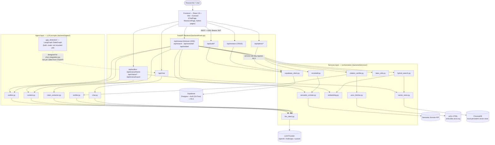
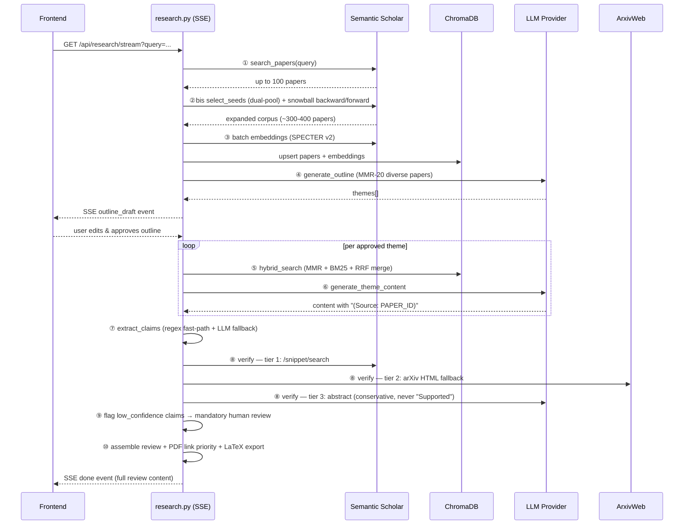
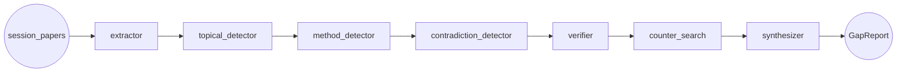

# Architecture Diagram — PaperPulse

## System Overview

## Data Flow — Literature Review Pipeline (①→⑩, `GET /api/research/stream`)

## Gap Detection Sub-graph (built, not yet wired into the API)

Hiện `chat_integration.py` đã code sẵn cầu nối (`run_gap_detection_chat`: collect session papers → paper_check → baseline search nếu thiếu → chạy graph trên), nhưng `backend/api/chat.py` và `backend/api/__init__.py` (`gap_router` bị comment) chưa gọi tới — module compile/test được nhưng chưa expose qua API.

## Component Details

| Component | Technology | Purpose |
|---|---|---|
| Frontend | React 19 + Vite + Zustand + Tailwind v4 | Chat-style research UI, review editor, knowledge graph panel, admin dashboard |
| Backend | FastAPI (Python 3.11+) | REST + SSE API server (`backend/main.py`) |
| Agent layer | Custom Python LLM modules (`backend/agent/`) | Outline / content / claim-extraction / verification prompts — no LangChain |
| Gap Detection | LangGraph `StateGraph` (`backend/module/gap_detection/`) | 7-node linear graph for research-gap reports; built, not yet mounted on the router |
| LLM Provider | OpenAI / Anthropic / custom (`services/llm_client.py`) | Text generation for every agent step, selected via `PROVIDER` env |
| Search | Semantic Scholar API (`services/semantic_scholar.py`) | Paper search, citation snowballing, snippet verification |
| Full-text fallback | `ar5iv.labs.arxiv.org` (`services/arxiv_fetcher.py`) | Tier-2 citation verification when no snippet exists |
| Vector Store | ChromaDB, local persistent (`services/vector_store.py`) | Stores SPECTER v2 embeddings, semantic retrieval |
| Keyword Search | `rank_bm25` + RRF merge (`services/hybrid_search.py`) | Combined with semantic search per theme |
| Database / Auth | Supabase — Postgres + GoTrue + RLS | Tables: `profiles`, `reviews`, `chats`, `messages`, `notifications`, `login_logs` |
| Deployment | Docker (multi-stage) + GitHub Actions | CI: lint-be → lint-fe → test → build → deploy |
