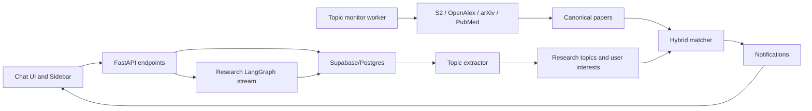

# BLUEPRINT: Chat History and Topic Monitoring

## Vibecode Kit v6.0

### Project Info

| Field | Value |
| --- | --- |
| Project | PaperPulse (C2-App-069) |
| Feature | Chat History + Topic Monitoring + Paper Notifications |
| Role | Contractor blueprint for Homeowner approval |
| Status | APPROVED - ready for Task Graph |
| Date | 2026-06-25 |

## 1. Goal

### Primary Goal

Build two connected product capabilities:

1. Persist chat/research sessions so users can reopen old searches and continue from previous research context.
2. Automatically track the user's most important research topics and notify them when new relevant papers appear, without requiring repeated manual searches.

### Product Principle

Chat history is the durable memory layer. Topic monitoring is derived from that memory layer.

The system must not treat every raw query as an independent notification source. It should normalize repeated or similar user interests into a small set of watched topics, then run background paper discovery against those topics.

## 2. Confirmed Product Decisions

| Decision ID | Decision | Status |
| --- | --- | --- |
| DEC-001 | Auto-watch is always enabled for demo mode. | Approved by Homeowner |
| DEC-002 | Only a few top user topics should be auto-watched, recommended cap: 3 active topics/user. | Approved by Homeowner |
| DEC-003 | MVP delivery is in-app notification by default. | Approved by Homeowner |
| DEC-004 | Email digest is Phase 2, opt-in, off by default. | Approved by Homeowner |
| DEC-005 | First email prompt appears when the first topic is auto-watched. | Approved by Homeowner |
| DEC-006 | Email digest is daily, only if at least one paper crosses the high-confidence threshold. | Approved by Homeowner |
| DEC-007 | Email limit is maximum 1 email/day/user. | Approved by Homeowner |
| DEC-008 | Push notification is not MVP. | Approved by Homeowner |
| DEC-009 | Push notification can be automatic in Phase 3 after in-app/email prove value, but platform permission remains required. | Approved by Homeowner |
| DEC-010 | Chat history retention is user-controlled deletion, no automatic expiry. | Approved by Homeowner |
| DEC-011 | Background topic monitoring does not count against user quota. | Approved by Homeowner |
| DEC-012 | User controls must include mute topic, pause all notifications, delete topic interest, and delete chat history. | Approved by Homeowner |

## 3. Scope

### In Scope for MVP

- Server-side chat session persistence.
- Server-side message persistence.
- Session list and session detail API.
- Soft-delete chat history.
- Connect research stream sessions to persistent chats.
- Auto-watch up to 3 highest-interest topics/user.
- In-app notifications for new relevant papers.
- Topic mute/delete and global notification pause.
- Background monitor with cost/spam guardrails.

### Out of Scope for MVP

- Email digest delivery implementation.
- Push notification implementation.
- Mobile app notification support.
- Charging quota for background monitoring.
- Full recommendation feed unrelated to user's existing topics.
- Admin analytics dashboard for notification performance.

### Phase 2

- Email digest settings.
- Prompt user when first topic becomes auto-watched.
- Daily digest generation.
- Email provider integration.

### Phase 3

- Push notification after value has been proven by in-app/email metrics.
- Device/browser subscription management.
- Automatic push routing after platform permission is granted.

## 4. Current Repo Baseline

### Existing Assets to Reuse

- Supabase/Postgres schema already has `chats`, `messages`, and `notifications`.
- Backend uses FastAPI and Supabase Auth JWT.
- Frontend chat UI uses Zustand session state.
- Research pipeline uses `/api/research/stream` with `thread_id`.
- LangGraph uses SQLite checkpointing for resumable execution state.
- Existing paper retrieval uses Semantic Scholar, OpenAlex, arXiv, and PubMed in the research module.
- Existing dedup logic already prioritizes DOI, arXiv ID, paperId, and fuzzy title matching.
- Existing Semantic Scholar rate limiter already controls API call pressure.

### Current Gaps

- Frontend chat sessions are local runtime state, not durable server state.
- `/api/chat` does not persist conversations.
- `/api/research/stream` creates a `thread_id` but does not persist chat/message records as the user-facing history source of truth.
- `notifications` exists in schema but has no full product flow for topic-derived paper alerts.
- There is no canonical topic model yet.
- There is no worker/scheduler for recurring paper discovery.
- There is no user-facing control surface for mute/pause/delete topic interest.

## 5. Architecture

### High-Level Flow



### Source of Truth

| Domain | Source of Truth | Notes |
| --- | --- | --- |
| User auth | Supabase Auth JWT | Existing pattern |
| Chat history | Supabase `chats` + `messages` | Durable user-facing history |
| Research execution checkpoint | LangGraph SQLite checkpointer | Runtime resume state, not chat history |
| Topic interests | New topic tables in Supabase/Postgres | Derived from chat and saved actions |
| Notifications | Supabase `notifications` + notification event table | In-app MVP |
| Paper metadata | New canonical papers table | Shared across topics/users |

## 6. Data Model

### 6.1 Existing Tables to Extend

#### `chats`

Recommended added fields:

| Field | Type | Purpose |
| --- | --- | --- |
| `thread_id` | text nullable | Links user-facing chat to LangGraph thread/session |
| `feature` | text not null default `research` | Distinguishes research, gap, pdf, or generic chat sessions |
| `status` | text not null default `idle` | `idle`, `running`, `awaiting_plan`, `error`, `complete` |
| `summary` | text nullable | Short session summary for sidebar/search |
| `last_message_at` | timestamptz nullable | Stable sorting for session list |
| `deleted_at` | timestamptz nullable | User-controlled soft delete |

#### `messages`

Recommended added fields:

| Field | Type | Purpose |
| --- | --- | --- |
| `seq` | integer nullable | Stable ordering within chat |
| `client_message_id` | text nullable | Idempotency for optimistic frontend sends |
| `status` | text not null default `done` | `pending`, `streaming`, `done`, `error` |
| `metadata` | jsonb not null default `{}` | Stores step traces, cited papers, pending plan, artifacts refs |

#### `notifications`

Keep existing table for MVP in-app delivery, but add references if needed:

| Field | Type | Purpose |
| --- | --- | --- |
| `topic_id` | uuid nullable | Links notification to watched topic |
| `paper_id` | uuid/text nullable | Links notification to canonical paper |
| `reason` | text nullable | Human-readable match explanation |
| `score` | numeric nullable | Final hybrid score |

### 6.2 New Tables

#### `research_topics`

Canonical topic rows shared across users.

| Field | Purpose |
| --- | --- |
| `id` | Topic identifier |
| `label` | Human-readable topic name |
| `normalized_query` | Clean canonical query |
| `keywords` | JSON array of key terms |
| `embedding` | Optional pgvector vector if enabled |
| `created_at`, `updated_at` | Lifecycle fields |

#### `user_topic_interests`

Per-user relationship to canonical topics.

| Field | Purpose |
| --- | --- |
| `user_id` | Owner |
| `topic_id` | Canonical topic |
| `interest_score` | Ranking signal |
| `state` | `auto_watching`, `muted`, `deleted`, `candidate` |
| `auto_watch_reason` | Why topic was selected |
| `last_checked_at` | Worker checkpoint |
| `last_notified_at` | Notification cooldown |

#### `papers`

Canonical paper metadata.

| Field | Purpose |
| --- | --- |
| `id` | Internal paper id |
| `doi` | Dedup key |
| `arxiv_id` | Dedup key |
| `s2_paper_id` | Semantic Scholar key |
| `openalex_id` | OpenAlex key |
| `pubmed_id` | PubMed key |
| `title`, `abstract`, `authors`, `year`, `published_at` | Paper metadata |
| `url`, `open_access_pdf` | Access metadata |
| `embedding` | Optional vector |
| `source_metadata` | JSONB raw source metadata |

#### `topic_paper_matches`

Records why a paper matched a topic.

| Field | Purpose |
| --- | --- |
| `topic_id` | Topic |
| `paper_id` | Paper |
| `vector_score` | Semantic similarity |
| `lexical_score` | Keyword/full-text match |
| `recency_score` | Newness |
| `authority_score` | Quality/credibility signal |
| `hybrid_score` | Final weighted score |
| `reason` | Explanation shown to user |
| `first_seen_at` | Discovery time |

#### `notification_events`

Idempotency table before writing to `notifications`.

| Field | Purpose |
| --- | --- |
| `user_id` | Recipient |
| `topic_id` | Watched topic |
| `paper_id` | Matched paper |
| `channel` | `in_app`, `email_digest`, `push` |
| `status` | `created`, `sent`, `skipped`, `failed` |
| `created_at` | Event time |

Unique key:

```text
unique(user_id, topic_id, paper_id, channel)
```

## 7. Topic Auto-Watch Policy

### MVP Rule

For demo mode, every user should always have up to 3 auto-watched topics if enough signals exist.

```text
max_auto_topics_per_user = 3
```

### Interest Signals

Interest score increases when:

- User starts a research session for the topic.
- User repeats a similar query.
- User approves a research plan.
- User saves a literature review.
- User saves or opens a research gap result.
- User returns to an old session.

### Selection Logic

```text
1. Extract candidate topic from user query/session.
2. Normalize candidate topic.
3. Merge into existing canonical topic if similarity is high.
4. Update user_topic_interests.interest_score.
5. Keep top 3 non-muted, non-deleted topics in state auto_watching.
6. Demote lower-ranked topics to candidate.
```

### User Control Overrides

- `muted` topics must not send notifications.
- `deleted` topic interests must not reappear unless the user searches it again later.
- Global pause disables delivery but does not stop topic scoring.

## 8. Hybrid Matching

### Formula

```text
hybrid_score =
  0.45 * vector_score
+ 0.25 * lexical_score
+ 0.20 * recency_score
+ 0.10 * authority_score
```

### Score Meanings

| Score | Meaning |
| --- | --- |
| `vector_score` | Semantic similarity between topic and paper title/abstract/keywords |
| `lexical_score` | Direct keyword/full-text match strength |
| `recency_score` | How recently the paper was published/indexed/submitted |
| `authority_score` | Quality signal from citations, venue/source quality, metadata completeness, OA availability |

### MVP Notification Thresholds

```text
in_app_threshold = 0.72
email_digest_threshold = 0.82
```

### Guard Conditions

```text
hybrid_score >= 0.72
AND recency_score >= 0.35
AND (vector_score >= 0.70 OR lexical_score >= 0.55)
AND notification does not already exist for user/topic/paper/channel
```

## 9. Delivery Policy

### In-App MVP

- Enabled by default.
- Writes rows to `notifications`.
- Shows unread count and notification list in UI.
- Maximum 5 notifications/user/day.

### Email Phase 2

- Off by default.
- Prompt user when the first topic becomes auto-watched.
- Daily digest only.
- Send only when at least one paper has `hybrid_score >= 0.82`.
- Maximum 1 email/user/day.

### Push Phase 3

- Not in MVP.
- Consider only after in-app/email show value.
- Product logic can route push automatically after platform permission is granted.
- Browser/mobile OS permission remains mandatory.

## 10. System Guardrails

```text
max_auto_topics_per_user = 3
max_notifications_per_user_per_day = 5
max_papers_per_topic_per_run = 50
min_in_app_threshold = 0.72
min_email_digest_threshold = 0.82
topic_cooldown = 24h
paper_dedup_order = DOI -> arXiv ID -> S2 paperId -> normalized title
unique_notification = user_id + topic_id + paper_id + channel
```

Background monitoring must not charge user quota, but it must respect system-level API cost, rate limits, and spam limits.

## 11. API Surface

### MVP Chat APIs

```text
GET    /api/chats
POST   /api/chats
GET    /api/chats/{chat_id}
DELETE /api/chats/{chat_id}
```

### MVP Topic APIs

```text
GET    /api/topics/interests
PATCH  /api/topics/interests/{topic_id}
DELETE /api/topics/interests/{topic_id}
```

### MVP Notification APIs

```text
GET    /api/notifications
PATCH  /api/notifications/{notification_id}
POST   /api/notifications/mark-all-read
```

### Phase 2 Email APIs

```text
GET   /api/notification-settings
PATCH /api/notification-settings
```

## 12. User Flows

### Flow A: User Reopens Old Research Session

```text
User opens app
-> Sidebar loads persisted chats
-> User selects old session
-> App loads messages and artifacts
-> User can read previous result or continue the research thread
```

### Flow B: First Auto-Watched Topic

```text
User searches "GraphRAG evaluation methods"
-> System persists chat and extracts topic
-> Topic becomes one of top 3 interests
-> In-app monitoring is active by default
-> System prompts user to optionally enable daily email digest
```

### Flow C: New Paper Notification

```text
Worker checks watched topics
-> Finds new paper
-> Dedups paper
-> Computes hybrid score
-> Creates notification event
-> Writes in-app notification
-> User sees unread notification
-> User opens paper and can start a new session from it
```

### Flow D: User Controls Noise

```text
User opens topic settings
-> Mutes a topic
-> Worker can still update paper matches
-> Delivery is suppressed for that user's muted topic
```

## 13. UI Direction

Preserve the existing PaperPulse app shell and visual language.

### UI Additions

- Sidebar session list becomes persisted server-backed data.
- Notification bell or notification entry in existing app chrome.
- Topic settings panel/list with top auto-watched topics.
- Small reason text for paper notification:

```text
Matched your topic "GraphRAG evaluation" because the paper discusses benchmark construction, retrieval quality, and evaluation protocols.
```

### UI Constraints

- Do not redesign the whole app shell.
- Do not replace the current ChatLayout.
- Do not create a separate landing page for this feature.
- Keep controls compact and operational: mute, pause all, delete topic, delete chat.

## 14. Technical Stack

Reuse current stack:

| Layer | Stack |
| --- | --- |
| Frontend | React + Vite + Zustand |
| Backend | FastAPI |
| Auth | Supabase Auth JWT |
| Database | Supabase/Postgres |
| Background worker MVP | Backend-managed worker command or scheduled endpoint |
| Background worker later | Celery/Redis if reliability and retry needs exceed MVP |
| Research pipeline | Existing LangGraph flow |
| Paper sources | Existing Semantic Scholar, OpenAlex, arXiv, PubMed adapters |
| Matching | Hybrid lexical + vector + recency + authority scoring |

## 15. Task Decomposition Preview

```text
TIP-CH-001: Chat Persistence Foundation
TIP-CH-002: Research Stream Persistence Integration
TIP-TM-001: Topic Schema and Auto-Watch Top 3
TIP-TM-002: Topic Extraction and Interest Scoring
TIP-TM-003: Paper Monitor Worker and Hybrid Matching
TIP-TM-004: In-App Notification API and UI
TIP-TM-005: User Controls for Topics and Notifications
TIP-EMAIL-001: Email Digest Settings and Prompt (Phase 2)
TIP-EMAIL-002: Daily Email Digest Worker (Phase 2)
TIP-PUSH-001: Push Notification Feasibility and Permission Model (Phase 3)
TIP-VERIFY-001: End-to-End Verification
```

## 16. Requirement Traceability

| Requirement | Blueprint Section |
| --- | --- |
| REQ-CH-001: Persist chat sessions server-side | Sections 5, 6, 11, 12 |
| REQ-CH-002: Reopen old search sessions | Sections 11, 12 |
| REQ-CH-003: User-controlled chat deletion | Sections 3, 6, 11, 12 |
| REQ-TM-001: Auto-watch user topics | Sections 7, 10 |
| REQ-TM-002: Monitor does not count quota | Sections 2, 10 |
| REQ-TM-003: In-app notification default | Sections 9, 11 |
| REQ-TM-004: Email digest opt-in Phase 2 | Sections 9, 11, 15 |
| REQ-TM-005: Push Phase 3 | Sections 9, 15 |
| REQ-TM-006: User controls | Sections 7, 11, 12 |
| REQ-TM-007: Guardrails for spam/cost | Sections 8, 10 |

## 17. Checkpoint Gates

### SCAN -> RRI

| Gate | Status | Evidence |
| --- | --- | --- |
| Existing stack identified | PASS | FastAPI, Supabase, Zustand, LangGraph present |
| Existing DB surface identified | PASS | `chats`, `messages`, `notifications` present |
| Gaps documented | PASS | Persistence, topics, worker, controls missing |

### RRI -> VISION

| Gate | Status | Evidence |
| --- | --- | --- |
| P0 product decisions answered | PASS | Delivery, retention, quota, auto-watch decisions recorded |
| Requirements matrix generated | PASS | Section 16 |
| Open P0 questions | PASS | None |

### VISION -> BLUEPRINT

| Gate | Status | Evidence |
| --- | --- | --- |
| Architecture proposed | PASS | Sections 5 and 6 |
| Tech stack justified | PASS | Section 14 reuses current repo stack |
| User flows documented | PASS | Section 12 |
| UI direction documented | PASS | Section 13 |

### BLUEPRINT -> TASK GRAPH

| Gate | Status | Evidence |
| --- | --- | --- |
| Human approval | PASS | Homeowner replied APPROVED on 2026-06-25 |
| Requirements mapped | PASS | Section 16 |
| No open P0 questions | PASS | All P0 decisions captured |

## 18. Approval Request

This Blueprint has been approved by the Homeowner.

Contractor may issue the Task Graph and Builder TIPs, while preserving the architecture and constraints in this document.
